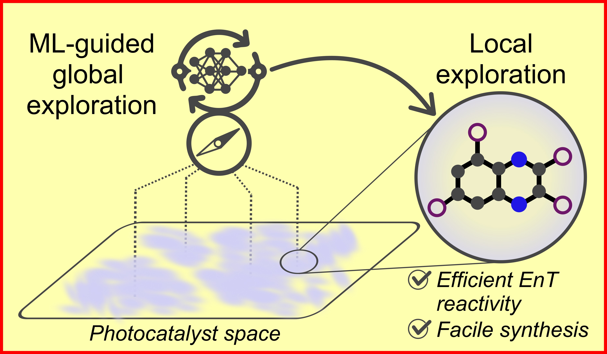

# Inverse Design of Organic Photocatalysts for Energy Transfer Catalysis

This repository contains the code for the inverse design of organic photocatalysts for energy transfer catalysis as described in this [paper](https://doi.org/10.1021/jacs.5c20087).

<p align="center">
  
</p>

## Installation
For installation run
```
git clone --recurse-submodules https://github.com/le-schlo/InvEnT.git

conda install -c conda-forge xtb==6.7.1
cd REINVENT4/
pip install -r requirements-linux-64.lock
pip install --no-deps .
```

The installation on a standard Linux machine takes approx. 2-3 minutes. <br />
The code is tested with python 3.10.

Optional dependencies:
- [stda](https://github.com/grimme-lab/std2/tree/v1.6.1) and [xtb4stda](https://github.com/grimme-lab/xtb4stda) <br />
  Tested with stda v1.6.1 and xtb4stda v1.0
  Statically linked binaries can be downloaded from [https://github.com/grimme-lab/xtb4stda/releases/tag/v1.0](https://github.com/grimme-lab/xtb4stda/releases/tag/v1.0)
  
- [Multiwfn](https://doi.org/10.1063/5.0216272) <br />
  Tested with Multiwfn v3.7 on Linux without GUI which can be downloaded from this [source](http://sobereva.com/multiwfn/misc/Multiwfn_3.7_bin_Linux_noGUI.zip)

## Run generative model
To run the model execute 
```
reinvent -l logging.log config.toml
```
An example config file with all run parameters can be found in `examples/config.toml`. A detailed description of all relevant parameters can be found in [examples/README.md](examples). The results will be saved to a csv file as specified in the config file under `summary_csv_prefix`.

## Data
The `data/` directory contains datasets for validating the triplet energy prediction, absorption wavelength prediction, and the ISC quantum yield. Moreover, the output of the generative models can be found in `data/generated_molecules/`.

## Citation
```
@article{Schlosser.2026,
abstract = {The discovery of new organic photocatalysts (PCs) for energy transfer (EnT) catalysis remains a significant challenge, largely due to the vast and underexplored chemical space and the delicate balance of the photocatalytic properties. While transition-metal catalysts are effective, their high cost and environmental impact necessitate the development of metal-free alternatives. In this work, we present a hybrid inverse molecular design strategy that combines global exploration with targeted local optimization to discover highly efficient organic PCs. Our approach leverages a generative model, guided by machine learning predictions and semiempirical simulations, to efficiently navigate chemical space and identify promising molecular scaffolds. We demonstrate the utility of this strategy by rediscovering known PCs and, more importantly, exploring uncharted structural regions, leading to the identification of novel candidates with favorable photophysical properties. A subsequent local exploration stage, using quantum mechanical calculations, allows refinement of the properties as well as control of the synthetic complexity. The practical applicability of the approach is demonstrated by performing a local exploration of one of the identified scaffolds and successfully synthesizing four candidate PCs. We showcase their catalytic aptitude in three different EnT-mediated reactions, including a challenging aza-photocycloaddition, where one of our designed PCs achieved 90{\%} yield, a performance comparable to a state-of-the-art iridium-based catalyst. This study highlights the power of a data-driven inverse design framework to bridge computational discovery and experimental validation, accelerating the identification of novel PCs and expanding the scope of EnT catalysis.},
 author = {Schlosser, Leon and Rendel, Nils H. and Gemen, Julius and Glorius, Frank and Jorner, Kjell},
 year = {2026},
 title = {Inverse Molecular Design for the Discovery of Organic Energy Transfer Photocatalysts: Bridging Global and Local Chemical Space Exploration},
 pages = {6451--6461},
 volume = {148},
 journal = {J. Am. Chem. Soc.},
 doi = {10.1021/jacs.5c20087}
}
```
